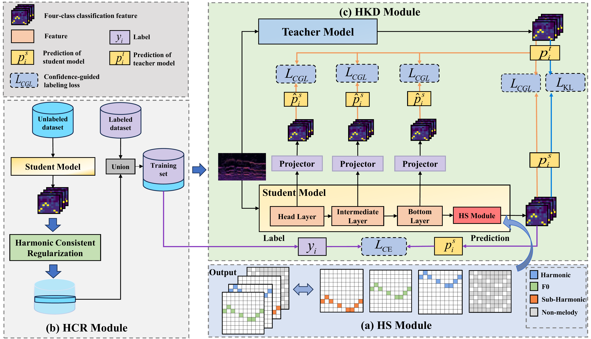

# HKDSME: Heterogeneous Knowledge Distillation for Semi-supervised Singing Melody Extraction Using Harmonic Supervision

This repository contains the offical PyTorch implementation for the paper accepted by ACM MM 2024 《HKDSME: Heterogeneous Knowledge Distillation for Semi-supervised Singing Melody Extraction Using Harmonic Supervision》

This paper proposes a heterogeneous knowledge distillation framework for semi-supervised singing melody extraction (HKDSME). The framework introduces a four-class classification paradigm using harmonic supervision to better capture melodic relations (HS). It improves pseudo-label accuracy by leveraging harmonics as consistent regularization and judging data availability based on harmonic positional relations (HCR). To build a lightweight model, a heterogeneous knowledge distillation (HKD) module transfers knowledge between different models, aided by a confidence-guided loss to reduce incorrect pseudo labels.

